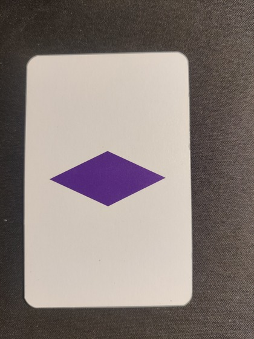
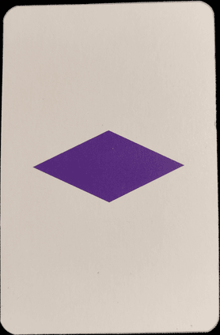
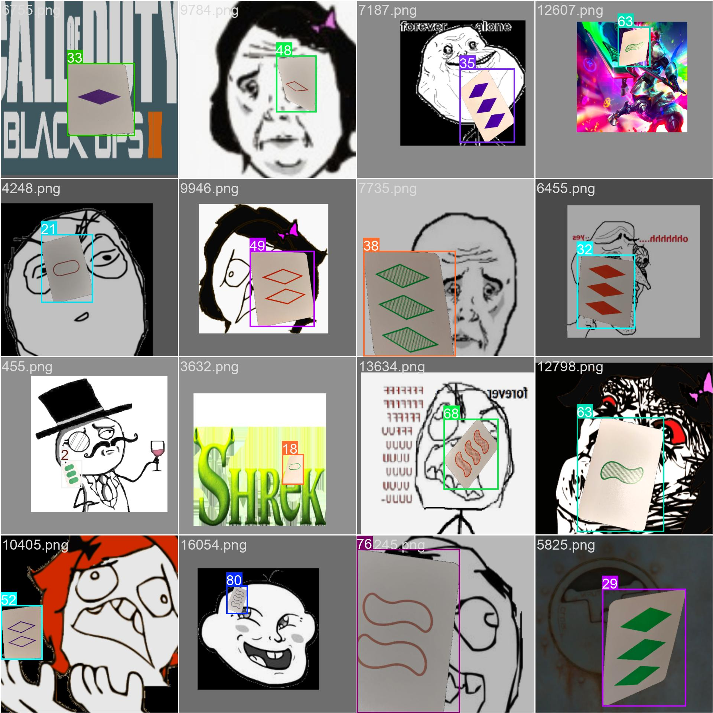
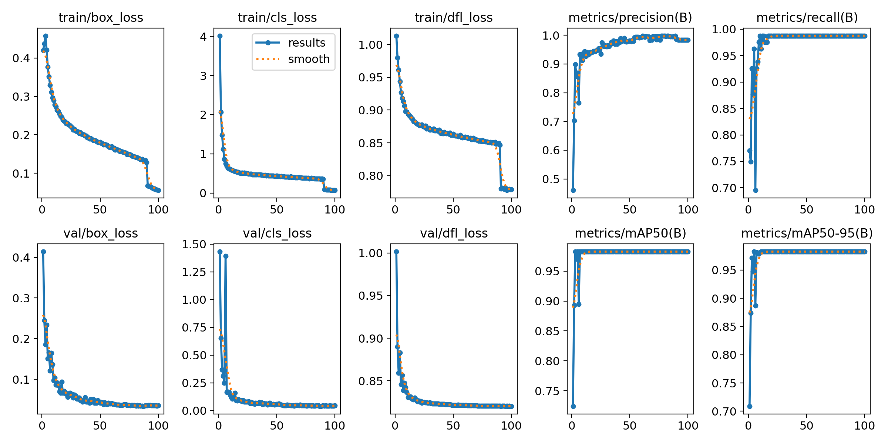
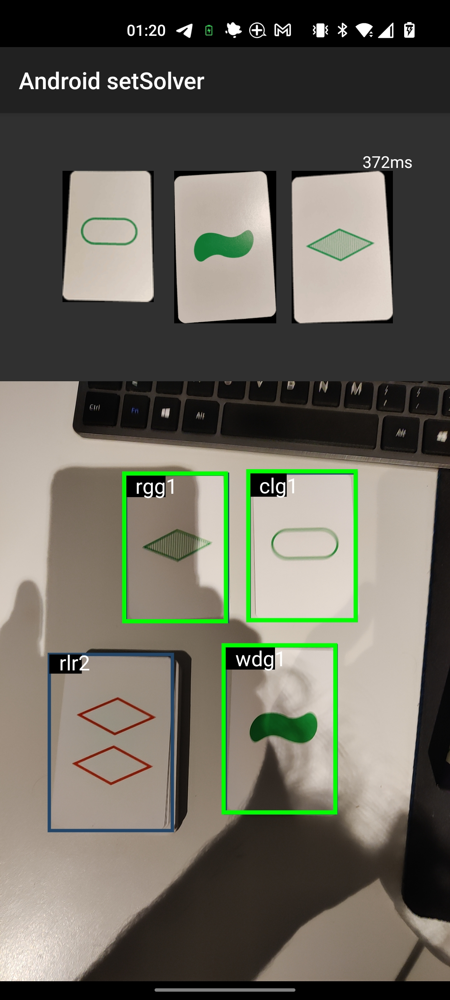
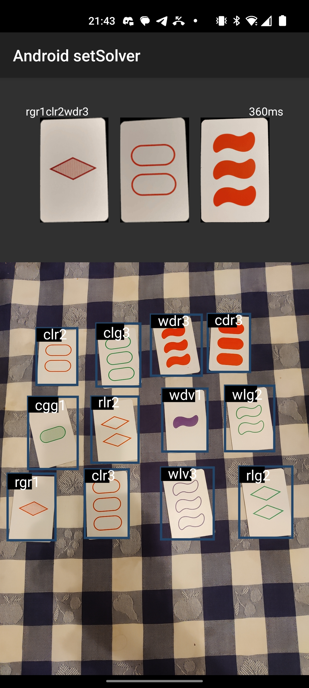

# Set SAT-Solver

To download the apk, press the following button:
<p align="center">
 <a href="https://github.com/JaumeAlbardaner/SFWIG/releases/download/1.1/SFWIG.apk">
  
</a> 
</p>


## What is Set?

Set is a fast-paced card game based on pattern recognition, where players race to identify sets of cards that share or differ across multiple attributes. The game is designed for 1 or more players and is known for its simplicity and depth of strategy, appealing to both casual and competitive players.

<p align="center">

</p>

## Deck

The deck consists of 81 unique cards, each with 4 attributes:
*   **Shape**: Each card can contain ovals/capsules (*c*), diamonds/romb (*r*) or squiggles/wave(*w*).
*   **Shading**: The shapes are either solid/dark (*d*), striped/gradient(*g*) and outlined/light(*l*). 
*   **Color**: The shapes come in red (*r*), green (*g*) or violet (*v*).
*   **Number**: Cards can show one (*1*), two (*2*) or three (*3*) shapes.


## Gameplay 

1.  **Setup**: Twelve cards are laid face-up in a grid.
2. **Finding a Set**: Players race to find a set of three cards that meet the set criteria (either all the same or all different for each attribute). There are no turns; the first player to spot a set calls out "Set!" and points to the cards.
3. **Validation and Replacement**: If the set is correct, the three cards are removed and replaced with new ones from the deck. If incorrect, the player must wait before calling another set.
4. **End of Game**: The game continues until the deck is depleted and no more sets can be found. The player with the most sets wins.

# Solver
As seen in the previous explanation, there are two main technologies at work:
* Card recognition, to recognise each card and differenctiate them from the others
* Logic, to ensure the constraints are respected.

To mimick the human behavior, these two technologies have been approached with the use of YOLOv8 and a SAT-solver

## Card recognition

To train a YOLO model to recognise images, one usually needs thousands of images per class to be trained. Since I'm lazy I only took one picture of each card, and added virtual noise to it later. Although it's not as robust it saves a lot of time  taking photos and labeling (mostly because we have 81 classes in this case).


The procedure to train the YOLO model was the following:
1. Take picture of all the cards on a black background.
<p align="center">

</p>

2. Run a segmentation algorithm to remove the parts of the image that don't belong to the card.
<p align="center">

</p>

3. With some randomization (translation/rotation/perspective transform), place the image of the card on top of another image (to act as noise) and write down its bounding box in a .txt file (YOLO standard).
<p align="center">


(the rage comics were most of my already-downloaded resources, any other images are also accepted as noise) 
</p>

4. Train the YOLO NN.

<p align="center">

</p>


## Logic

Since there are some constraints to be fullfilled, we must ensure that the selection of cards **satisfies** these conditions. Hence why I decided to use a SAT-solver.

A SAT solver is a software tool used to determine whether a given Boolean formula can be satisfied, meaning if there exists an assignment of true or false values to variables that makes the entire formula evaluate to true.

In this SAT problem, I've made the first N variables correspond to the *"picking"* of a card 1..N, meaning that if the variable is true, that card is one of the 3 cards that make a set.

After this, 12 boolean variables follow with the properties of each variable (4 properties * 3 possibilties = 12 boolean literals). The order of these variables is the following:

(Shape) c r w / (Filling) l g d / (colour) g r v / (number) 1 2 3


To talk in the context of the SAT solver, the following clauses have to be applied:

1. Exactly 3 cards must be selected.

Most solvers already implement the "exactly" restriction with the iterative use of ```atLeast``` and ```atMost```. In the case of the Kotlin library used, it is called using ```solver.addExactly(new VecInt(variableArray), requiredTrue);```

2. If a card is selected, its properties must be fulfilled. E.g. in a card with properties 3 4 8 10 this would be set as follows:

$x_1 \implies (3 \land 4 \land 8 \land 10)$

$(-x_1 \lor 3)\land(-x_1 \lor 4)\land(-x_1 \lor 8)\land(-x_1 \lor 10)$

3. A property can only be fulfilled if a card with said property is chosen. E.g property 3 is present in cards $x_1$, $x_4$, $x_{12}$, $x_9$:

$x_1 \implies (x_1 \lor x_4 \lor x_{12} \lor 9)$

$-x_1 \lor x_1 \lor x_4 \lor x_{12} \lor 9$

4. There can't be a property with 2 different values (it must be either all the same or all different). For property with variables 3,4 and 5.

$(3 \lor 4 \lor 5)\land(3 \lor -4 \lor -5)\land(-3 \lor 4 \lor -5)\land(-3 \lor -4 \lor 5)$

# Resulting app

Combining the object detection together with the SAT-solver logic, the following result is achieved:

(In the left image an improved version of the system is shown, where the set is highlighted)

<p align="center">


</p>
